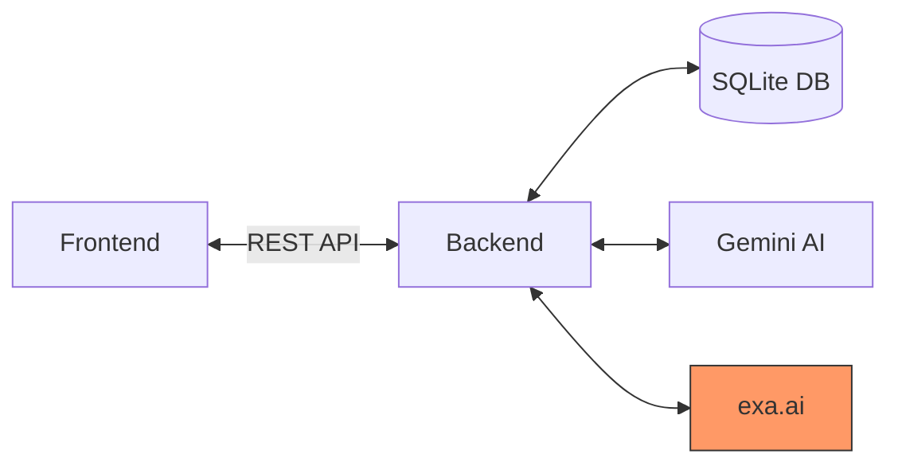

# Legal Doc Ai

AI-powered legal document generation and management system.

## 🚀 Quick Start

### Prerequisites
- Node.js 18+
- Python 3.9+
- API keys for Gemini (and optionally exa.ai)

### Setup

1. **Backend Setup**
   ```bash
   cd backend
   cp .env.example .env  # Update with your API keys
   python -m venv venv
   source venv/bin/activate  # Windows: venv\Scripts\activate
   pip install -r requirements.txt
   ```

2. **Frontend Setup**
   ```bash
   cd frontend
   cp .env.local.example .env.local  # Update API endpoints if needed
   npm install
   ```

3. **Environment Variables**
   ```env
   # Backend (.env)
   GEMINI_API_KEY=your_gemini_api_key
   EXA_API_KEY=your_exa_api_key  # Optional
   DATABASE_URL=sqlite:///./legal_templates.db
   
   # Frontend (.env.local)
   NEXT_PUBLIC_API_URL=http://localhost:8000
   ```

4. **Run**
   ```bash
   # Terminal 1 - Backend
   cd backend
   python run.py
   
   # Terminal 2 - Frontend
   cd frontend
   npm run dev
   ```
   Visit: http://localhost:3000

## 🏗 Architecture



### Key Components
1. **Frontend**
   - Next.js 15 with TypeScript
   - React Hook Forms + Zod validation
   - Radix UI components

2. **Backend**
   - FastAPI REST API
   - SQLite database
   - Gemini AI integration
   - File processing pipeline

## 🤖 Prompt Design

### Template Extraction
```python
"""Extract variables from legal document. Return JSON with:
- document_type: Type of legal document
- variables: List of {name, type, description, required}
- sections: Document structure"""
```

### Document Generation
```python
"""Generate legal document based on template and user inputs.
Template: {template_text}
Variables: {user_inputs}

Return only the completed document with variables filled in."""
```

## 📡 API Endpoints

### Templates
- `POST /api/templates/upload` - Upload DOCX/PDF template
- `GET /api/templates` - List all templates
- `GET /api/templates/{id}` - Get template details
- `GET /api/templates/{id}/variables/csv` - Export variables as CSV
- `GET /api/templates/{id}/export` - Export template as Markdown

### Draft Generation
- `POST /api/draft/match` - Match query to best template
- `POST /api/draft/instance` - Create draft instance
- `POST /api/draft/answers` - Update draft answers
- `POST /api/draft/generate` - Generate final draft
- `GET /api/draft/{id}` - Get draft instance details
- `GET /api/draft/{id}/export/markdown` - Export draft as Markdown
- `GET /api/draft/{id}/export/docx` - Export draft as DOCX

## 📤 Output Formats

The system generates three types of outputs:

1. **Rendered Markdown Draft** (`/api/draft/{id}/export/markdown`)
   - Clean markdown with filled-in variables
   - Ready for preview or further editing

2. **Saved Template File** (`/api/templates/{id}/export`)
   - Markdown format with YAML front-matter
   - Includes metadata: title, doc_type, jurisdiction, tags
   - Variables section with descriptions and types
   - Template content with `{{variable}}` placeholders

3. **Template Variables Export**
   - **JSON**: Via `/api/templates/{id}` endpoint
   - **CSV**: Via `/api/templates/{id}/variables/csv` endpoint
   - Fields: key, label, description, data_type, is_required, default_value

Example template structure:
```markdown
---
template_id: tpl_sample_agreement_v1
title: Sample Agreement
File_description: Template for business agreements
jurisdiction: California
doc_type: agreement
variables:
  - key: party_name
    label: Party Name
    description: Full legal name of the party
    example: "Acme Corporation"
    required: true
  - key: effective_date
    label: Effective Date
    description: Date when agreement becomes effective
    example: "2025-01-15"
    required: true
similarity_tags: ['contract', 'business', 'agreement']
---

This agreement between {{party_name}}...
```

**Key Features:**
- YAML front-matter with complete metadata
- Variables with examples for better user guidance
- snake_case variable keys (automatically enforced)
- Double-brace {{variable}} placeholders
- Similarity tags for AI-powered matching

See `TEMPLATE_FORMAT_SPEC.md` for complete specification.

## 📦 Dependencies

### Backend
- FastAPI
- python-docx
- python-multipart
- google-generativeai

### Frontend
- Next.js 15
- React 19
- Tailwind CSS
- Framer Motion

## 📄 License
MIT
